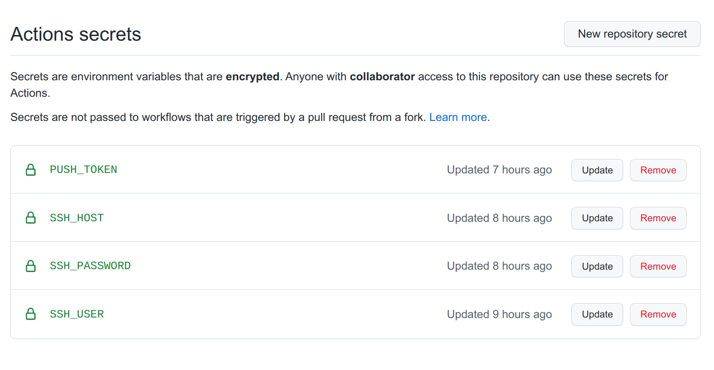
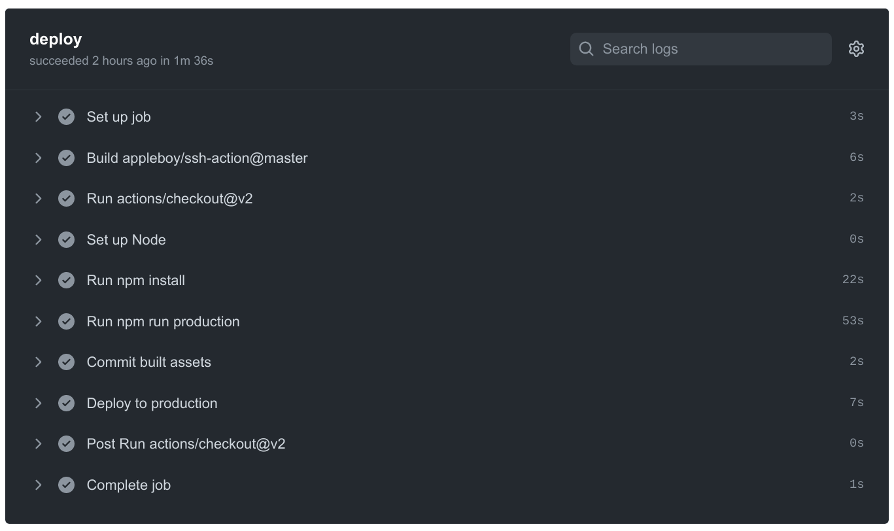

### Pengantar
Github Actions adalah layanan gratis dari github yang bisa berjalan di repository yang terkonfigurasi. Dalam tutorial ini saya manfaatkan layanan ini untuk deploy Laravel secara otomatis.

### Persiapan
Sebelum melakukuan konfigurasi, ada hal yang perlu saya siapkan, diantaranya:
1. Server/Vps yang sudah terkonfigurasi web server, mysql dan php. [Cara Instalasi LAMP (Linux, Apache, Mysql, PHP) di Ubuntu 18.04](/instalasi-lamp-di-ubuntu-18-04/)
2. Repository Github

### Setup git
Terdapat 3 branch diantaranya:
- **main**, branch untuk development
- **production**, branch yang kita push ke github
- **deploy**, branch yang terbuat otomatis ketika workflow dari github actions berjalan

Sehingga flow nya seperti: **main** -> **production** -> **deploy**

### Server Deployment Script
Buat file bash script, saya beri nama **server_deploy.sh**. Script ini akan berjalan di server.
```bash
#/!bin/sh

set -e

echo "Deploying application ..."

#Enter maintenance mode
(php artisan down 'Web sedang dalam pemeliharaan. Silahkan kembali beberapa saat lagi') || true
  #update codebase
  git fetch origin deploy
  git reset --hard origin/deploy

  # Install dependencies based on lock file
  composer install --optimize-autoloader --no-dev

  # Migrate database
  php artisan migrate --force

  # Note: If you're using queue workers, this is the place to restart them.
  # ...

  # Clear cache
  php artisan optimize

  # Reload PHP to update opcache
  echo "" | sudo -S service php7.4-fpm reload

# Exit maintenance mode
php artisan up

echo "Application deployed!"
```

### Local Deployment Script
Buat file bash lagi, saya kasih nama **deploy.sh**
```bash
#/!bin/sh

set -e

vendor/bin/phpunit

(git push) || true

git checkout production
git merge main

git push origin production

git checkout main
```

### Github Actions
Create file **.github/workflows/main.yml**
```bash
name: CD
 
on:
  push:
    branches: [ production ]
 
jobs:
  deploy:
    runs-on: ubuntu-latest
    steps:
    - uses: actions/checkout@v2
      with:
        token: ${{ secrets.PUSH_TOKEN }}
    - name: Set up Node
      uses: actions/setup-node@v1
      with:
        node-version: '12.x'
    - run: npm install
    - run: npm run production
    - name: Commit built assets
      run: |
        git config --local user.email "myemail@email.com"
        git config --local user.name "My Name"
        git checkout -B deploy
        git add -f public/
        git commit --allow-empty -m "Build front-end assets"
        git push -f origin deploy
    - name: Deploy to production
      uses: appleboy/ssh-action@master
      with:
        username: ${{ secrets.SSH_USER }}
        host: ${{ secrets.SSH_HOST }}
        password: ${{ secrets.SSH_PASSWORD }}
        script: 'cd /var/www/html/appdir && ./server_deploy.sh'
```

**PUSH_TOKEN**, **SSH_USER**, **SSH_HOST**, dan **SSH_PASSWORD**, saya isi masing-masing variable di Tab Settings -> Secrets.

Sesuaikan juga nama directory dengan mengganti **appdir**.

### Penggunaan
1. Push branch **main** dan **production** ke github
2. Login server dan clone repo dari github. Saya clone menggunakan metode menyisipkan token, supaya setiap deploy tidak selalu meminta login github. [Akses Repository Github tanpa Login](/akses-repository-github-tanpa-login/)
```bash
cd /var/www/html && git clone https://c904a061a164cb45a9abf5dbc6c8b8f4c16d6xxx@github.com/user/test.git myapp
```
```bash
cd myapp && git checkout production && git checkout -b deploy
```
3. Dari local repo kita jalankan perintah:
```bash
./deploy.sh
```
