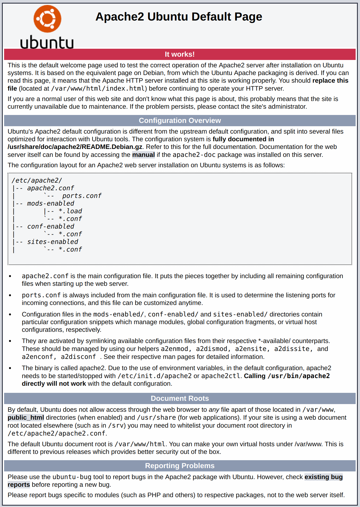

### Pengantar

Lamp (Linux, Apache, Mysql, PHP) adalah sebuah gabungan dari beberapa software open source yang dipasang bersamaan di Server dengan tujuan aplikasi web yang kita bangun dapat berjalan dan dioperasikan. Di tutorial ini dijelaskan cara instalasi LAMP di Ubuntu 18.04 Server.

### Persiapan

Sebelum melakukan instalasi LAMP, pastikan terlebih dahulu Vps atau server sudah terinstall **Ubuntu 18.04 Server** dengan akun **non-root user**.

## 1. Instalasi Apache

Apache adalah web server yang dapat digunakan bersamaan dengan PHP secara gratis / open source untuk menjalankan aplikasi web. Sampai saat ini, Apache telah banyak digunakan oleh banyak pengembang web.

Pastikan Ubuntu sudah diupdate

```bash
sudo apt update
```

Instal Apache

```bash
sudo apt install apache2 -y
```

#### Setting Firewall untuk mengijinkan trafik Web

Pastikan firewall mengijinkan HTTP dan HTTPS trafik. Bisa kita cek dengan perintah berikut ini:

```bash
sudo ufw app list
```

```bash
sudo ufw app info "Apache Full"
```

Untuk mengijinkan trafik HTTP dan HTTPS yang masuk ke server, jalankan perintah:

```bash
sudo ufw allow "Apache Full"
```

Instalasi **Apache2** berhasil, silahkan cek di browser.

```
http://ip_server_kamu
```



## 2. Instalasi Mysql

**Mysql** adalah Database Management System (DBMS) atau Sistem manajemen basis data. Pada dasarnya **Mysql** adalah jembatan atau perantara Aplikasi yang kita bangun dengan database. 

Kita mulai dengan menjalankan perintah:

```bash
sudo apt install mysql-server -y
```

Kemudian jalankan lagi perintah:

```bash
sudo mysql_secure_installation
```

Perintah diatas adalah konfigurasi dasar **Mysql**, silahkan sesuaikan dengan kebutuhan aplikasi anda.

## 3. Instalasi PHP

```bash
sudo apt install php7.0 libapache2-mod-php7.0
```

```bash
sudo apt install php7.0-mysql php7.0-curl php7.0-gd php7.0-intl php-pear php-imagick php7.0-imap php7.0-mcrypt php-memcache php7.0-pspell php7.0-recode php7.0-sqlite3 php7.0-tidy php7.0-xmlrpc php7.0-xsl php7.0-mbstring php-gettext php7.0-opcache php-apcu
```

```bash
sudo systemctl restart apache2
```

#### Test Instalasi PHP

```bash
sudo nano /var/www/html/info.php
```

```php
// info.php
<?php phpinfo(); ?>
```

```bash
sudo chown www-data:www-data /var/www/html/info.php
```

silahkan cek di browser

```
http://ip_server/info.php
```

## 4. Instalasi Phpmyadmin

```bash
sudo apt install phpmyadmin -y
```

kemudian buat user baru mysql supaya dapat login ke phpmyadmin

```bash
sudo mysql -u root
```

```sql
CREATE USER 'admin'@'localhost' IDENTIFIED BY 'yourpassword';
GRANT ALL PRIVILEGES ON *.* TO 'admin'@'localhost' WITH GRANT OPTION;
FLUSH PRIVILEGES;
```

Ganti **admin** dan **yourpassword** diatas sesuai keinginan.

```
http://ip_server/phpmyadmin
```

Silahkan test instalasi dengan login di browser.