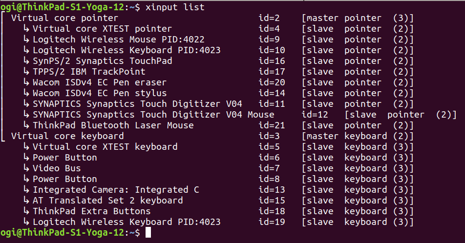
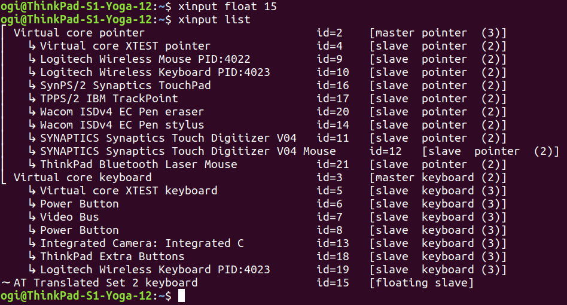
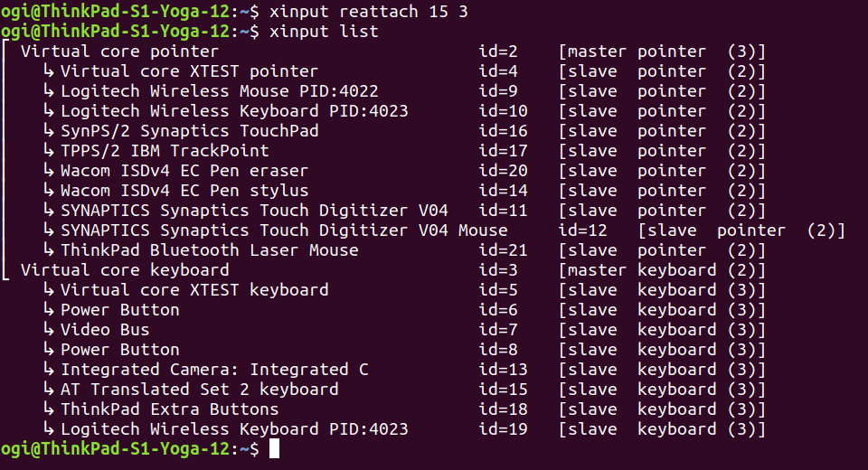

#### Kenapa kita perlu mematikan keyboard?

Ada beberapa alasan kenapa saya harus/perlu mematikan keyboard, diantaranya adalah:
- Ada salah satu atau lebih tombol di keyboard yang error (menekan sendiri). Jika ini terjadi, pekerjaan kita akan terganggu. Salah satu contoh, tombol **Backspace** yang menekan sendiri, jika kita sendang menulis dokumen, pasti tidak akan pernah selesai karena selalu terhapus huruf demi huruf. 

- Lebih nyaman pakai keyboard external, karena sudah banyak tombol keyboard internal yang mati.

Mungkin ada alasan lain selain yang saya utarakan diatas.

#### Bagaimana cara mematikan / disable keyboard di Ubuntu?

1. Sebelum disable, ketahui dulu nomor **id** dan nomor **master** dengan menjalankan perintah:

```bash
xinput list
```



Dari output diatas kita mendapatkan informasi data nomor **id** dan **master** dari keyboard internal yang akan saya matikan, yaitu **AT Translated Set 2 keyboard id=15	[slave  keyboard (3)]**, **15** adalah nomor **id** dan **3** adalah nomor master. Informasi itu akan saya butuhkan ketika akan menyalakan kembali keyboard.

2. Mematikan Keyboard. Jalankan perintah:

```bash
xinput float 15
```

Untuk melihat perubahan, jalankan lagi perintah:

```bash
xinput list
```



Sudah terlihat perubahannya bukan? saya test keyboardnya dan berhasil di disable.

#### Bagaimana cara menyalakan kembali Keyboard?

Jalankan perintah:
```bash
xinput reattach 15 3
```

**15** adalah **id**, sedangan **3** adalah **master**

Cek kembali perubahan

```bash
xinput list
```



Dari output diatas, status nya sudah berubah kembali. Saya test keyboardnya dan sudah berhasil enable lagi.